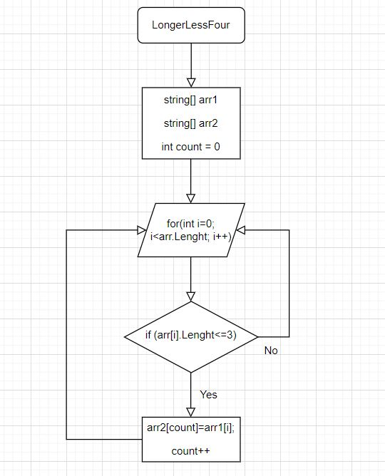

## Задача

Написать программу, которая из имеющегося массива строк формирует массив из строк, длинна которых меньше либо равна 3 символа. Первоначальный массив можно ввести с клавиатуры, либо задать на старте выполнения алгоритма. При решении не рекомендуется пользоваться коллекциями, лучше обойтись исключительно массивами.

---

### Примеры

1. ["hello", "2", "world", ":-)"] -> ["2", ":-)"]

2. ["1234", "1567", "-2", "computer science"] -> ["-2" ]

3. ["Russia", "Denmark", "Kazan"] -> []

---

### Решение

Показываем два массива: массив 1 и массив 2. 
С помощью цикла выявляем элементы массива которые меньше или равны трем символам, 
если "ДА" элемент массива заносится в count. 
Переменная сount увеличивается на 1 и возращается к циклу (for) 
в котором i увеличивается на 1.

Блок-схема решения:

----